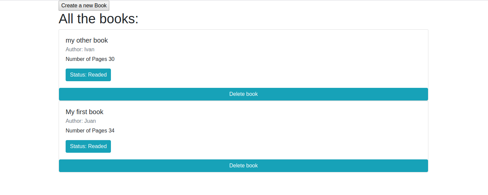

# Library

> A basic library using objects to store books.

    

The porpuse of this project was to build an interface for a library using an array of objects as storage. We also use localStorage API to persist information from the client part.

## Built With

- Bootstrap 4
- HTML
- JavaScript

## Live Demo

[https://JuanPabloGil.github.io/Library/](https://JuanPabloGil.github.io/Library/)

## Getting Started

To get a local copy up and running follow these simple example steps.

### Prerequisites

Download the project

    $ git clone https://github.com/JuanPabloGil/Library.git

### Usage

- Open **index.html** file with your favorite browser. It's inside the project's root directory.
- That's it. Start saving your books.

## Authors

👤 **Ivan Ulises Guzman Sanchez**

- Github: [@fivan18](https://github.com/fivan18)
- Twitter: [@fivanunam](https://twitter.com/fivanunam)
- Linkedin: [fivan](https://www.linkedin.com/in/fivan)

👤 **Juan Pablo Gil**

- [GitHub](https://github.com/JuanPabloGil ) 
- [@LinkedIn](https://www.linkedin.com/in/juan-pablo-gil-1321a515a/) 
- jpablomgil@gmail.com

## 🤝 Contributing

Contributions, issues and feature requests are welcome!

Feel free to check the [issues page](https://github.com/JuanPabloGil/Library/issues).

## Show your support

Give a ⭐️ if you like this project!

## Acknowledgments

- Thanks to [Twitter Bootstrap Project](https://getbootstrap.com/2.0.2/)

## 📝 License

This project is [MIT]() licensed.

